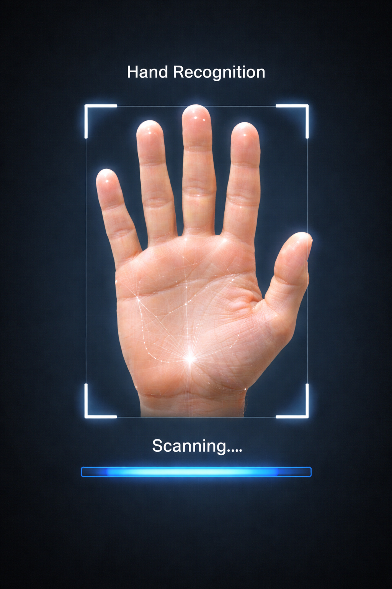

**Hand Gesture Image Viewer 🖐️🖼️**

A **Python project** that lets you **interact with images using hand gestures** via your webcam. Move, drag, and zoom images with your hand—no mouse or keyboard required!

**Features ✨**

* **Hand gesture control:** Move and drag the image using your index finger.
* **Zoom in/out:** Pinch gestures allow zooming for better view.
* **Real-time webcam feed:** Smooth performance with OpenCV.
* **Lightweight and easy to run:** No heavy ML models or extra installations required.

**Demo 📸**



> Move your hand to drag the image. Use pinch gesture to zoom.

---

**Installation ⚙️**

1. **Clone the repo:**

```bash
git clone https://github.com/YourUsername/hand-gesture-image-viewer.git
cd hand-gesture-image-viewer
```

2. **Create a virtual environment (recommended):**

```bash
python3 -m venv venv
source venv/bin/activate  # Linux / Mac
venv\Scripts\activate     # Windows
```

3. **Install dependencies:**

```bash
pip install -r requirements.txt
```

> `requirements.txt` example:

```
opencv-python
mediapipe
numpy
```

4. **Add your image** to the project folder and update the `IMAGE_PATH` variable in `gesture_image_viewer.py`.


 **Usage 🚀**

**Run the viewer:**

```bash
python gesture_image_viewer.py
```

* Move your index finger to drag the image.
* Use pinch gestures to zoom in/out.
* Press `q` to quit the program.


**How it works 🧠**

1. Uses **Mediapipe Hands** to detect hand landmarks.
2. Calculates index finger tip coordinates.
3. Moves or zooms the image based on the finger's position and gesture distance.
4. OpenCV handles image display and interactions in real-time.
